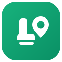

<div align="center">
  
  <h1>Jatri — Client</h1>
  <p><em>Next.js 15 · React 19 · TypeScript · Tailwind CSS</em></p>
</div>

The Jatri frontend: a Next.js App Router app with a **live seat map**, role-aware dashboards, search &
discovery, and a Stripe-redirect checkout flow.

> Part of the **Jatri** monorepo — see the root [`README.md`](https://github.com/KPorus/Jatri/tree/master/README.md) and
> [`docs/ARCHITECTURE.md`](https://github.com/KPorus/Jatri/tree/master/docs) for system diagrams.
Backend repo [`Jatri backend`](https://github.com/KPorus/Jatri-backend)

---

## 🧱 Tech Stack

- **Framework:** Next.js 15 (App Router) + React 19, TypeScript
- **Styling:** Tailwind CSS + `cn` helper (`clsx` + `tailwind-merge`), `next-themes` dark/light mode
- **Forms:** React Hook Form + Zod resolvers
- **Realtime:** `socket.io-client` (live seat updates)
- **Data:** `axios` client with a JWT request interceptor
- **Auth:** BetterAuth (Google) + custom JWT (email/password)
- **Viz/UX:** Recharts (dashboards), Swiper (homepage slider), `react-hot-toast`, `lucide-react`

---

## 📂 Project Structure

```
client/src/
├── app/
│   ├── (public)/           # home, tickets, about, contact, login, register, auth callback
│   ├── dashboard/          # role-aware area: user, vendor, admin
│   │   ├── admin/          # users, vehicles, advertise
│   │   ├── vendor/         # trips, add-trip, vehicles, revenue
│   │   ├── my-bookings/ · transactions/ · profile/
│   ├── api/auth/[...all]/  # BetterAuth route handler
│   ├── layout.tsx · loading.tsx · error.tsx · not-found.tsx
├── components/
│   ├── trips/SeatMap.tsx   # ⭐ realtime seat map (socket events)
│   ├── trips/ (TripCard, Countdown), home/, dashboard/, layout/, ui/, auth/
├── context/AuthContext.tsx
└── lib/                    # api, socket, guest, auth, types, utils
```

---

## ⭐ The live seat map

`components/trips/SeatMap.tsx` is the heart of the UX:

1. On mount it `trip:join`s the trip's socket room and seeds seat statuses from the API.
2. Tapping a seat emits `seat:select` **with an ack callback** — UI confirms on success, rolls back + toasts on conflict.
3. It listens for `seat:locked`, `seat:released`, and `seat:booked` to keep the map in sync with everyone else in real time.
4. A stable per-browser `guestId` (`lib/guest.ts`) lets **guests hold seats before logging in**.

Seat states are colour-coded: **available · selected · held · booked**.

---

## 🔑 Auth model

- **Email/password** → server-issued JWT stored under `tc_token`; attached automatically by the axios
  interceptor (`lib/api.ts`).
- **Google** → BetterAuth (`app/api/auth/[...all]`) handles OAuth, then exchanges for the app JWT.
- Login is **only required at checkout** — browsing and seat holding work as a guest.

---

## ⚙️ Setup

```bash
cd client
cp .env.local.example .env.local   # fill in values
npm install
npm run dev                        # http://localhost:3000
```

### Scripts
| Script | Action |
|--------|--------|
| `npm run dev` | Start dev server |
| `npm run build` | Production build |
| `npm start` | Serve production build |
| `npm run lint` | Lint |

### Environment (`client/.env.local`)
| Var | Description |
|-----|-------------|
| `NEXT_PUBLIC_API_URL` | Backend REST base, e.g. `http://localhost:5000/api` |
| `NEXT_PUBLIC_SOCKET_URL` | Socket.io URL, e.g. `http://localhost:5000` |
| `NEXT_PUBLIC_GOOGLE_CLIENT_ID` | Google OAuth client id |
| `NEXT_PUBLIC_IMGBB_KEY` | ImgBB key for client-side image upload |
| `BETTER_AUTH_SECRET` | BetterAuth secret |
| `GOOGLE_CLIENT_ID` / `GOOGLE_CLIENT_SECRET` | Google OAuth credentials |

> Ensure the backend is running first (see [`server/README.md`](../server/README.md)) and that
> `NEXT_PUBLIC_API_URL` / `NEXT_PUBLIC_SOCKET_URL` point at it.

---

## 🎨 Branding

Logo assets live in assets folder and are mirrored in `public/` (`logo.svg`, `logo-full.svg`).
Brand palette is the Tailwind `brand` emerald scale (see `tailwind.config.ts`).
